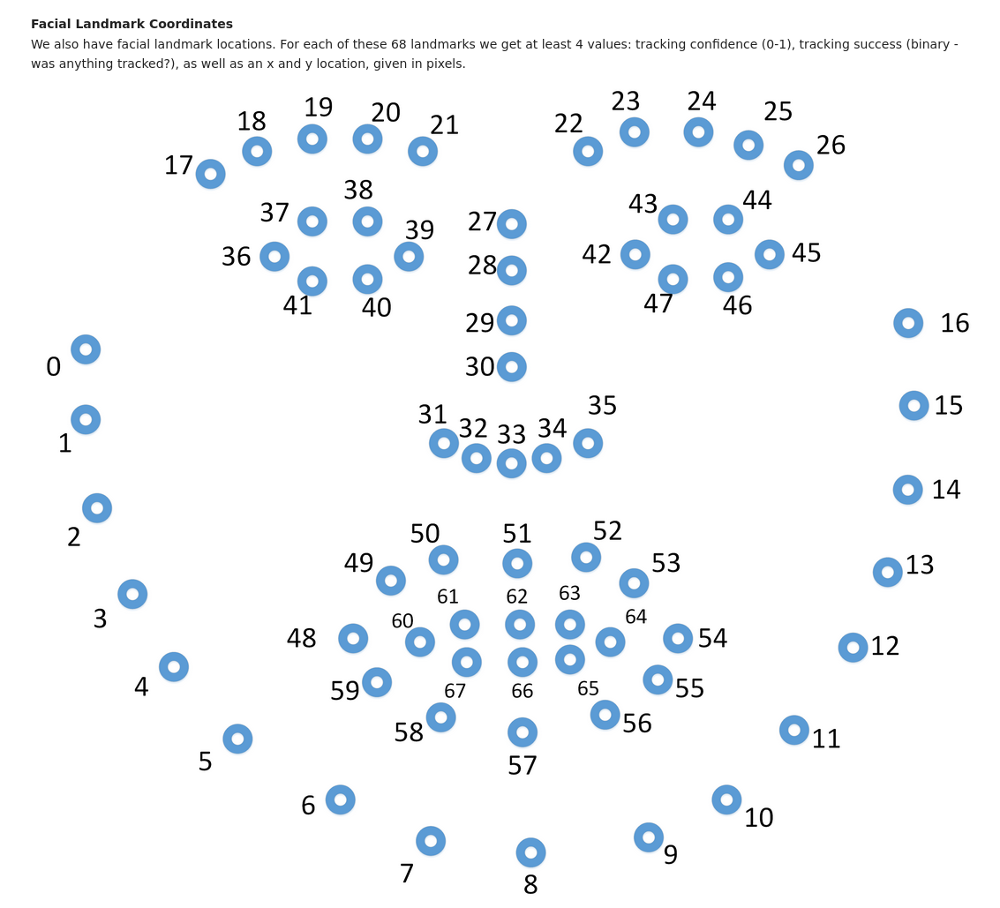

# Methods

## OpenFace

See `Datasets/BalanceCorpus/OpenFace` for an example notebook.

For the eyebrows we are interested in the XY coordinates of the points 17-26



The example in the notebook uses the middle point of each eyebrow (19 and 24).

```python
eyebrow_L = openface_features[["timestamp","x_24","y_24"]].rename({"x_24":'X',"y_24":"Y"},axis='columns')
eyebrow_R = openface_features[["timestamp","x_19","y_19"]].rename({"x_19":'X',"y_19":"Y"},axis='columns')
```
